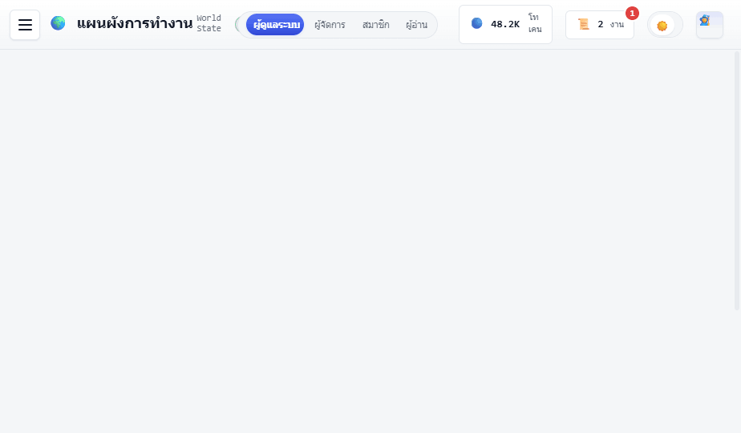

<div align="center">

# ✨ PiKaOs — A Workspace for Your AI Agent Team ✨

**Manage your AI team… like playing a cute RPG 🎮**

Create · assign tasks · track your AI Agent team through workspaces, quests, tools, and a knowledge base
Clean, warm design, Thai-first 💜


</div>

---

## 🌈 What is PiKaOs?

PiKaOs is an **"agent-ops workspace"** — a place where you can build and manage an AI Agent team like managing a real team,
but wrapped in a light RPG flavor that's fun to use and easy to understand 🧙‍♀️🦉🛠️

> 🐷 *Starting from the chaos of managing many AIs… ending in a single place that's organized, cute, and under control*

Instead of scattered AI setups, ungovernable permissions, and costs you can't keep up with —
PiKaOs brings everything together in one place: **Agents · tasks · tools · knowledge · permissions · quotas** ✅

---

## 🎀 The Cute Features You Get

- 👔 **Create your own Agents** — set their role, skills, tools, model, and rules (status updates itself via AI!)
- 📜 **Quest board** — assign tasks to Agents and watch them go queued → in progress → done, with worklogs
- 🌍 **Workspace (World)** — a cute top-down view where you see the team walking around
- 🧰 **Tool library** — connect MCP · LINE OA · Telegram · HTTP · Webhook and more, all in one place
- 📚 **Knowledge base (Codex) + cited search** — less duplicate work, fewer AI hallucinations
- 🔑 **Fine-grained permissions (RBAC)** + per-user token quotas + audit logs
- 🌗 **2 themes** light/dark · 🗣️ **multiple languages/dialects** (formal · fantasy · martial-arts hero!) switch instantly
- 🧠 **Multiple models** — GPT · Claude · local models, selectable per Agent

---

## 🖼️ What the App Looks Like

<div align="center">


<br/><br/>


&nbsp;


</div>

---

## 🚀 How to Start Playing

Super easy, just **double-click** 👉 [`start.bat`](../PiKaOs-Core/start.bat)

It takes care of everything for you 💫
1. 🐳 Checks/starts Docker (if it doesn't come up, run [`fix-docker.bat`](../PiKaOs-Core/fix-docker.bat) to repair it)
2. 🧩 Brings up the **4 separate stacks** in order (data: Postgres·Redis·MinIO → backend: API → ai: worker → frontend: Vite)
3. 🌐 Opens the web app at **http://localhost:5173** for you, then closes itself (see logs in Docker Desktop)

Want to shut everything down? 👉 Double-click [`stop.bat`](../PiKaOs-Core/stop.bat) (stops all 4 stacks)

Then **log in with:**

| Username | Password | Role |
|---|---|---|
| `somchai` | `pikaos123` | Admin (sees everything) ⭐ |

> 💡 There are other demo accounts too (`nicha` manager · `kitt` `ploy` members · `anan` reader) — all with the same password `pikaos123`

---

## 🧱 What It's Built With

| Part | Technology |
|---|---|
| 🎨 Frontend | **Vite + React** · PiKaOs's own design system · key-based i18n |
| ⚙️ Backend | **FastAPI** (Python) · SQLAlchemy async · JWT + Redis (real login) |
| 🗄️ Data | **PostgreSQL 16** · **Redis** · **MinIO** (stores md/image/log/pdf files) |
| 🐳 All together | **docker-compose** — 4 separate stacks (data · backend · ai · frontend), brought up with `start.bat` / stopped with `stop.bat` |

---

## 🗂️ Project Structure

The project splits into 3 sibling folders under `PiKaOs-Projects/` (code · docs · plugin apps):

```
PiKaOs-Projects/
├── 🎨 PiKaOs-Core/                 main code (monorepo)
│   ├── Frontend/              Vite + React web app
│   ├── Backend/               FastAPI (auth · API · WebSocket) + arq worker
│   ├── deploy/                compose, 4 separate stacks (data · backend · ai · frontend)
│   ├── start.bat              start button — brings up 4 stacks (double-click!)
│   └── stop.bat               stops all 4 stacks
├── 🎀 PiKaOs-Docs/            docs + design (you are here)
│   ├── design-system/         design system + previews + System Design slides
│   └── docs/                  project docs (see docs/README.md)
└── 📦 PiKaOs-Plugin/      the Compare website, extracted into a plugin app
```

---

## 📍 Current Status

- ✅ **Foundation complete** — real auth on Postgres · server-side fine-grained permissions (RBAC) · i18n · CI · the whole stack on Docker
- ✅ **Agent run engine (core)** — arq task queue + separate-process worker · resumable when the worker crashes (resume) · token quotas · live worklog · 117 test cases passing *(still a stub LLM — not connected to a real model yet)*
- ✅ **Compare** — UAT check against Production + extracted into a plugin app ([PiKaOs-Plugin](../PiKaOs-Plugin))
- 🟡 **Coming next** — connecting real models (HERMES multi-agent + OpenAI/Claude/Local) · migrating data from localStorage → API · knowledge base + RAG

Want to see the whole big picture? 👉 Read the [**System Design**](docs/architecture/system-design.md) (with full diagrams + ER)
or open the slides [`design-system/System Design Presentation.html`](design-system/System%20Design%20Presentation.html) 🖥️✨

---

<div align="center">

Built with 💜 by **saksit chuenmaiwaiy**

*PiKaOs — making working with AI fun* 🐷✨

</div>
