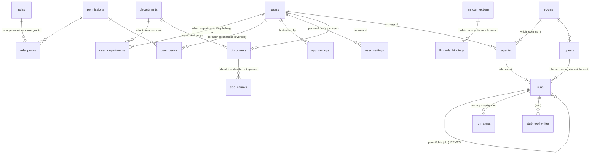

# PiKaOs — Data Model / ER (as-built · table-by-table · for whoever picks this up next)

> **What is this document** — a map of the PiKaOs database **as actually built in the code today**, not a future blueprint.
> Written so **someone with no tech background can follow it**: every table's purpose in plain language, every column states what it holds, and it says
> which table connects to which table (the relationships).
>
> - **The source of truth for the schema = migrations** in [`Backend/alembic/versions/`](../../../PiKaOs-Core/Backend/alembic/versions) + [`models.py`](../../../PiKaOs-Core/Backend/app/models.py). This document is an easy-to-read summary — if they conflict, the code is always right.
> - The engine's blueprint/design rationale is in [system-design.md §7](system-design.md); the grouping into modules is in [modularity.md](modularity.md); RAG/embedding is in [knowledge-rag.md](knowledge-rag.md). This document is **"what actually exists + what each field means"**.
> - **Rule (mandatory):** whenever you change the schema → update this file in the same commit (CLAUDE.md §2.3). See [§7 How to maintain this document](#7-how-to-maintain-this-document-mandatory).

---

## 0. How to read this (basics for non-tech readers)

A database = a cabinet holding several "tables". Think of each table as **one Excel sheet**:

| Term | In plain language |
|---|---|
| **table** (ตาราง) | one Excel sheet, holding items of the same kind (e.g. table `users` = the list of people who can log in) |
| **row** (แถว) | one entry in the table (e.g. one user, one document file) |
| **column** (คอลัมน์/ช่อง) | a data field of a row (e.g. the `email` field) |
| **PK** = primary key | the **unique identifier** of a row — used to point at it precisely (mostly an `id` of UUID type) |
| **FK** = foreign key | a field that **points to a row in another table** = "a relationship" (e.g. `documents.owner_id` points to `users.id` = who this document belongs to) |
| **index** | the "table of contents" of a table — makes lookups faster (does not change the meaning of the data) |
| **unique** | duplicate values not allowed (e.g. `username` cannot repeat) |
| **nullable** | can it be left empty — empty = `NULL` (no value yet) |

**What happens to the "child" when you "delete the parent" (ON DELETE)** — very important, because it guards against broken data:

| Rule | In plain language | Example |
|---|---|---|
| **CASCADE** | delete parent → **delete all children along with it** | delete one `documents` file → that file's `doc_chunks` disappear too (no leftovers) |
| **SET NULL** | delete parent → **child stays**, but the pointing field becomes empty | delete a user → their documents still exist, but `owner_id` becomes empty (no owner) |

**Status of each table in this document (legend):**

| Marker | Means |
|---|---|
| 🟢 **LIVE** | has code that reads/writes over real HTTP or WebSocket — users can reach it |
| 🟡 **ENGINE** | built + has tests + used by worker/WebSocket — **but no button/endpoint yet for users to create it themselves** (coming in the engine phase that wires it into the UI) |
| ⚪ **unused** | the table exists in the baseline (intentionally placed per [modularity.md](modularity.md)) but **no code touches it yet** — the frontend uses localStorage as a temporary substitute |
| 🧪 **TEST** | a table for tests only — real deployments don't write to it |

> **Count summary (Jun 2026):** 19 tables · 🟢 LIVE 13 · 🟡 ENGINE 4 · ⚪ unused 1 (`rooms`) · 🧪 TEST 1 (`stub_tool_writes`).
> The tables that are "not time to use yet" (`subtasks` / `tools_config` / `notifications`) are **intentionally not created yet** — they'll be created when that feature is actually built (modularity.md §4).

---

## 1. Relationship overview (ER diagram)

Grouped into 4 **modules** (bounded contexts — [modularity.md](modularity.md)). Iron rule: **other modules may only point FKs into `core`** (no pointing across to another module) — so each system can be lifted onto a separate machine.

> Note: `departments` is also pointed to by several tables (it's the "department" dimension for filtering visibility) — but right now there is **no seed/screen for creating departments**, so it's usually empty (users see only their own + whatever is set org-wide). The code that actually uses this join: [`knowledge_service.search_documents`](../../../PiKaOs-Core/Backend/app/services/knowledge_service.py).

---

## 2. Module: core (identity · permissions · departments)

The shared foundation every deployment must have. Other tables can point FKs into here, but core points out to nowhere.

### 2.1 `users` 🟢 — people who can log in (real people, not agents)

People who have a system account. Passwords are stored as a **hash (argon2)**, never the real value.

| column | type | what it holds (plain language) | notes |
|---|---|---|---|
| `id` | UUID | **PK** the user's identifier | |
| `username` | varchar(64) | login name | **unique** + index — no duplicates |
| `email` | varchar(255) | email | **unique** + index |
| `display` | varchar(120) | display name | |
| `role` | varchar(32) | role (`admin`/`manager`/`member`/`viewer`) | default `member` |
| `status` | varchar(32) | account status (`active`/suspended) | default `active` |
| `avatar` | varchar(64) | emoji/avatar image | |
| `quota` | bigint | token quota allowed (empty = unlimited) | nullable |
| `period` | varchar(16) | quota period (`weekly`/`monthly`) | |
| `used` | bigint | how many tokens used so far | |
| `password_hash` | varchar(255) | encrypted password (argon2) | **never stores/returns the real password** |
| `last_login` | timestamptz | when they last logged in | nullable |
| `created_at` | timestamptz | when created | default `now()` |

- **Who points to users:** `documents.owner_id`, `doc_chunks.owner_id`, `agents.owner_id`, `rooms.created_by`, `quests.created_by` (all **SET NULL** — delete a user and their items remain, but ownerless) · `user_perms.user_id`, `user_departments.user_id` (**CASCADE** — deleting a user clears their permissions/department memberships).
- **Code that touches it:** [`repositories/users.py`](../../../PiKaOs-Core/Backend/app/repositories/users.py) · [`auth_service.py`](../../../PiKaOs-Core/Backend/app/services/auth_service.py) · seed: [`scripts/seed.py`](../../../PiKaOs-Core/Backend/scripts/seed.py) (default `somchai`/`pikaos123`).

### 2.2 `departments` 🟢 — departments in the organization (scope dimension)

One organization, many departments. Used to control "who sees whose stuff".

| column | type | what it holds | notes |
|---|---|---|---|
| `id` | UUID | **PK** | |
| `name_th` | varchar(120) | department name (Thai) | |
| `name_en` | varchar(120) | department name (English) | |
| `created_at` | timestamptz | when created | |

- **Who points to departments:** `user_departments.department_id` (**CASCADE**) · the `department_id` field of `documents`/`doc_chunks`/`rooms`/`agents`/`quests`/`runs` (all **SET NULL**).
- **Actual status:** there's still no screen/seed for creating departments → the table is usually empty. The structure is ready, but the "manage departments" feature isn't enabled yet.

### 2.3 `user_departments` 🟢 — which departments a user belongs to (many-to-many)

A "junction" table — one user can be in many departments, one department has many users.

| column | type | what it holds | notes |
|---|---|---|---|
| `user_id` | UUID | FK → `users.id` (**CASCADE**) | **composite PK** |
| `department_id` | UUID | FK → `departments.id` (**CASCADE**) | **composite PK** + index |
| `is_primary` | bool | whether this is the user's primary department | default `false` |

- **Code that touches it:** [`repositories/documents.py`](../../../PiKaOs-Core/Backend/app/repositories/documents.py) (`user_department_ids`) · [`repositories/quests.py`](../../../PiKaOs-Core/Backend/app/repositories/quests.py) — used to answer "which departments is this user in" in order to filter visibility.

### 2.4 RBAC — `roles` · `permissions` · `role_perms` · `user_perms` 🟢

The server-side permission system. Formula: **effective permissions = the role's permissions ∪ per-user allows − per-user denies** (deny wins); `admin` implicitly has every permission. Mirrors the frontend [`data-users.jsx`](../../../PiKaOs-Core/Frontend/src/data/data-users.jsx).

**`roles`** — roles (PK = `key`, e.g. `admin`)

| column | type | what it holds |
|---|---|---|
| `key` | varchar(32) | **PK** role code (`admin`/`manager`/…) |
| `name_th` / `name_en` | varchar(64) | role name in 2 languages |
| `description` | varchar(255) | description |
| `color` | varchar(32) | badge color in the UI |
| `system` | bool | whether it's a system role (cannot be deleted) |

**`permissions`** — the full list of permissions (PK = `key`, e.g. `llm.manage`)

| column | type | what it holds |
|---|---|---|
| `key` | varchar(64) | **PK** permission code (`user.manage`, `codex.manage`, `llm.manage`, …) |
| `grp` | varchar(32) | permission group (Admin/Agents/Knowledge/…) — categorizes them in the UI |
| `name_th` / `name_en` | varchar(128) | permission name in 2 languages |

**`role_perms`** — which role gets which permissions (junction)

| column | type | what it holds | notes |
|---|---|---|---|
| `role_key` | varchar(32) | FK → `roles.key` (**CASCADE**) | **composite PK** |
| `perm_key` | varchar(64) | FK → `permissions.key` (**CASCADE**) | **composite PK** |

**`user_perms`** — per-user permissions (override on top of the role)

| column | type | what it holds | notes |
|---|---|---|---|
| `user_id` | UUID | FK → `users.id` (**CASCADE**) | **composite PK** |
| `perm_key` | varchar(64) | FK → `permissions.key` (**CASCADE**) | **composite PK** |
| `allow` | bool | `true` = grant extra / `false` = deny (deny wins) | |

- **Code that touches RBAC:** [`repositories/rbac.py`](../../../PiKaOs-Core/Backend/app/repositories/rbac.py) · [`rbac_service.py`](../../../PiKaOs-Core/Backend/app/services/rbac_service.py) · gated at the route via `Depends(require_perm("..."))` ([`deps.py`](../../../PiKaOs-Core/Backend/app/deps.py)). Permissions cached in Redis.

### 2.5 `app_settings` 🟢 — server-scoped key/value config (shared across users/devices)

A small JSONB key/value store for settings that must be identical for **everyone** (not a per-user preference). First consumer: the sidebar nav arrangement (`key="nav"`), edited in the Menu Manager — previously per-browser localStorage, so it never crossed machines. Generic on purpose; future server-scope config reuses the same table. Migration `0007_app_settings`.

| column | type | what it holds | notes |
|---|---|---|---|
| `key` | varchar(64) | setting name (e.g. `nav`) | **PK** |
| `value` | jsonb | the setting payload (for `nav`: the list of groups) | shape owned by the frontend |
| `updated_by` | UUID | FK → `users.id` (**SET NULL**) | who last wrote it (null if that user is deleted) |
| `updated_at` | timestamptz | last write time | `server_default now()` |

- **Read** = any authenticated user (the sidebar loads it on sign-in); **write** = `options.manage`. Routes: `GET/PUT /api/settings/nav` ([`routers/settings_config.py`](../../../PiKaOs-Core/Backend/app/routers/settings_config.py)), repo [`repositories/app_settings.py`](../../../PiKaOs-Core/Backend/app/repositories/app_settings.py). Part of the **core** module.

### 2.6 `user_settings` 🟢 — per-user config that follows the user across devices

The **per-user** counterpart to `app_settings`: personal preferences (theme, lexicon pack, …) keyed by `(user_id, key)` so they travel with the person instead of the browser. Used by the "ตั้งค่าระบบ" Settings screen. The two-tier config rule (Tools = global · Settings = per-user) is in [lessons.md](../process/lessons.md). Migration `0008_user_settings`.

| column | type | what it holds | notes |
|---|---|---|---|
| `user_id` | UUID | FK → `users.id` (**CASCADE**) | **composite PK** — gone when the user is deleted |
| `key` | varchar(64) | setting name (e.g. `theme`, `lex`) | **composite PK** |
| `value` | jsonb | the setting value (e.g. `"pro-dark"`, `"english_pro"`) | |
| `updated_at` | timestamptz | last write time | `server_default now()` |

- Each user reads/writes **only their own** rows: `GET /api/settings/me` + `PUT /api/settings/me/{key}` ([`routers/settings_config.py`](../../../PiKaOs-Core/Backend/app/routers/settings_config.py)), repo [`repositories/user_settings.py`](../../../PiKaOs-Core/Backend/app/repositories/user_settings.py). Part of the **core** module.

---

## 3. Module: knowledge (document store — markdown = the source of truth)

The actual files are stored in MinIO (object storage); the tables hold only **metadata**. See [knowledge-rag.md](knowledge-rag.md).

### 3.1 `documents` 🟢 — files in the knowledge store (1 row = 1 file)

| column | type | what it holds | notes |
|---|---|---|---|
| `id` | UUID | **PK** | |
| `owner_id` | UUID | FK → `users.id` (**SET NULL**) file owner | index · nullable |
| `kind` | varchar(16) | kind (`md`/`image`/`pdf`/`docx`/`log`/`other`) | default `md` |
| `name` | varchar(255) | displayed file name | |
| `object_key` | varchar(512) | the MinIO object holding the **markdown truth** (after a pdf/docx is converted, this points at the generated `.md`) | |
| `source_object_key` | varchar(512) | the **original** uploaded pdf/docx kept as a Ref after conversion (E6) — empty when the upload was already markdown/text | nullable · added in migration 0006 |
| `content_type` | varchar(128) | MIME (e.g. `text/markdown`) | |
| `size` | bigint | size (bytes) | |
| `department_id` | UUID | FK → `departments.id` (**SET NULL**) — empty = visible org-wide | index · nullable |
| `ingest_status` | varchar(16) | embed status (`pending`/`done`/`failed`/`skipped`) | added in migration 0005 |
| `embedding_model` | varchar(120) | which model it was embedded with | |
| `summary` | text | doc-level summary made at ingest (enrich B, E7) — a coarse "what is this file" layer also embedded as a summary-chunk; derived/rebuildable | nullable · added in migration 0009 · NULL unless `ingest_summary_enabled` + a summarize provider |
| `created_at` | timestamptz | when uploaded | |

- **Who points to documents:** `doc_chunks.document_id` (**CASCADE** — delete a file → its embedding pieces disappear too).
- **Code that touches it:** [`repositories/documents.py`](../../../PiKaOs-Core/Backend/app/repositories/documents.py) · [`knowledge_service.py`](../../../PiKaOs-Core/Backend/app/services/knowledge_service.py) · [`ingestion_service.py`](../../../PiKaOs-Core/Backend/app/services/ingestion_service.py) (converts pdf/docx → markdown via [`converters.py`](../../../PiKaOs-Core/Backend/app/services/converters.py) on ingest, binds `source_object_key`) · route [`routers/knowledge.py`](../../../PiKaOs-Core/Backend/app/routers/knowledge.py) (uploading requires the `codex.manage` permission).
- **Visibility scope:** admin sees everything · the owner sees their own · `department_id IS NULL` = org-wide · otherwise you must be in the same department.

### 3.2 `doc_chunks` 🟢 — document pieces + vectors (semantic search index / RAG)

Slices documents by heading, then converts each piece into a **vector (embedding)** for "nearest-meaning" search. It's a **rebuildable, disposable cache** — every re-ingest deletes the old and inserts everything anew; no data lives only here.

| column | type | what it holds | notes |
|---|---|---|---|
| `id` | UUID | **PK** | |
| `document_id` | UUID | FK → `documents.id` (**CASCADE**) which file this piece belongs to | index |
| `owner_id` | UUID | FK → `users.id` (**SET NULL**) | index · copied from the file (denormalize) |
| `department_id` | UUID | FK → `departments.id` (**SET NULL**) | index · copied from the file |
| `seq` | integer | piece order within the file (0,1,2,…) | **unique(document_id, seq)** |
| `heading` | text | the piece's markdown heading | |
| `content` | text | the piece's text body | |
| `embedding` | **vector(1024)** | bge-m3 vector (1024 dimensions) | read/write via **raw SQL only** |
| `embedding_model` | varchar(120) | which model it was embedded with | |
| `created_at` | timestamptz | | |

- **Special index:** `ix_doc_chunks_embedding` of type **HNSW** (`vector_cosine_ops`) — fast top-k nearest search even as the data grows.
- **Why raw SQL:** asyncpg has no codec for the `vector` type → it's sent as a literal `'[...]'::vector` (no added dependency). It's the only table allowed to write SQL directly outside the ORM — found in [`repositories/doc_chunks.py`](../../../PiKaOs-Core/Backend/app/repositories/doc_chunks.py).
- **Used by:** ingest = worker job ([`ingestion_service.py`](../../../PiKaOs-Core/Backend/app/services/ingestion_service.py)) · search = `GET /api/knowledge/search` ([`knowledge_service.search_documents`](../../../PiKaOs-Core/Backend/app/services/knowledge_service.py)) — score = cosine, scope filtered in SQL.
- **Requires the `vector` extension** (migration 0005 runs `CREATE EXTENSION IF NOT EXISTS vector`; db image = `pgvector/pgvector:pg16`).

---

## 4. Module: llm-config (configure the LLM without hardcoding)

Lets the admin set the LLM's provider/model/key from the **จัดการเครื่องมือ** (tools management) screen instead of editing `.env`. Every route requires the `llm.manage` permission. See the code [`llm_config_service.py`](../../../PiKaOs-Core/Backend/app/services/llm_config_service.py).

### 4.1 `llm_connections` 🟢 — LLM connections (1 row = 1 configured provider)

| column | type | what it holds | notes |
|---|---|---|---|
| `id` | UUID | **PK** | |
| `name` | varchar(120) | self-assigned name (e.g. "Claude prod") | |
| `provider` | varchar(32) | `ollama` / `openai` / `anthropic` | |
| `model` | varchar(120) | model (e.g. `claude-opus-4-8`) | empty = use default |
| `base_url` | varchar(512) | endpoint (if you need to set it yourself) | nullable |
| `api_key_enc` | varchar(1024) | **encrypted API key** (Fernet) | **never stores/returns the real key** |
| `is_active` | bool | whether this is the one the engine is currently using | default `false` |
| `created_at` | timestamptz | | |

- **Key rule:** only 1 row can be active at a time — enforced by the **partial unique index** `uq_llm_connections_active` (`unique WHERE is_active`).
- **Who points to it:** `llm_role_bindings.connection_id` (**CASCADE** — delete the connection → its bindings disappear too).
- **Key safety:** encrypted with [`crypto.py`](../../../PiKaOs-Core/Backend/app/crypto.py) (Fernet, key derived from `secret_key`→`jwt_secret`); on read it returns only `api_key_set` (bool), never the key.

### 4.2 `llm_role_bindings` 🟢 — which system job uses which connection

Binds a "system role" (engine/search/summarize) to a connection — e.g. let RAG use a local llama while the engine uses Claude. Not bound = use the active one.

| column | type | what it holds | notes |
|---|---|---|---|
| `role` | varchar(32) | **PK** system role (`engine`/`search`/`summarize`) | |
| `connection_id` | UUID | FK → `llm_connections.id` (**CASCADE**) | |
| `updated_at` | timestamptz | when last changed | |

---

## 5. Module: engine (agent-ops · job runs)

The agent-running system. **Built + has tests** and used live by worker/WebSocket — but **there is still no HTTP endpoint for users to create agents/quests/runs themselves** (coming in the phase that wires it into the UI). The frontend currently shows from localStorage/seed ([pikaos-dev-rules.md §5](../pikaos-dev-rules.md)).

### 5.1 `rooms` ⚪ — rooms (not yet used in the backend)

| column | type | what it holds | notes |
|---|---|---|---|
| `id` | UUID | **PK** | |
| `name` | varchar(120) | room name | |
| `template` | varchar(64) | room template | |
| `created_by` | UUID | FK → `users.id` (**SET NULL**) | |
| `department_id` | UUID | FK → `departments.id` (**SET NULL**) | index |
| `created_at` | timestamptz | | |

- ⚠️ **Status:** this table has **no backend code touching it yet** (no repository/service/SQL); the `room_id` field in `agents`/`quests`/`runs` is also not read by anyone yet. The UI manages rooms via localStorage `guildos.rooms.v2` ([room-3d.md](../features/room-3d.md)) temporarily.
- **Kept intentionally** as part of the engine baseline ([modularity.md](modularity.md) §1, locked 2026-06-16) — it will be wired in for real when the engine UI is built. Removing it = an architectural decision, and modularity.md must be updated too.

### 5.2 `agents` 🟡 — AI agent (a different thing from `users`)

| column | type | what it holds | notes |
|---|---|---|---|
| `id` | UUID | **PK** | |
| `owner_id` | UUID | FK → `users.id` (**SET NULL**) agent owner | index |
| `name` | varchar(120) | agent name | |
| `role` | varchar(64) | the agent's function | |
| `status` | varchar(32) | status (`idle`/running/…) | **set by the runner only**, users can't set it |
| `model` | varchar(64) | the model the agent uses | |
| `skills` | text[] | skills (array) | default `{}` |
| `granted_tools` | text[] | allowed tools (array) | default `{}` |
| `sprite` | varchar(64) | character image | |
| `room_id` | UUID | FK → `rooms.id` (**SET NULL**) | index (not used yet) |
| `department_id` | UUID | FK → `departments.id` (**SET NULL**) | index |
| `created_at` | timestamptz | | |

- **Who points to it:** `runs.agent_id` (**SET NULL**).
- **Code that touches it:** [`agent_runner.py`](../../../PiKaOs-Core/Backend/app/services/agent_runner.py) · [`repositories/runs.py`](../../../PiKaOs-Core/Backend/app/repositories/runs.py).

### 5.3 `quests` 🟡 — quests/tasks (assigned to an agent to do)

| column | type | what it holds | notes |
|---|---|---|---|
| `id` | UUID | **PK** | |
| `title` | varchar(255) | task name | |
| `brief` | text | task details | |
| `room_id` | UUID | FK → `rooms.id` (**SET NULL**) | index |
| `status` | varchar(32) | status (`open`/…) | default `open` |
| `created_by` | UUID | FK → `users.id` (**SET NULL**) | |
| `department_id` | UUID | FK → `departments.id` (**SET NULL**) | index |
| `deleted_at` | timestamptz | **soft delete** — has a value = deleted (still in the table) | nullable |
| `created_at` | timestamptz | | |

- **Who points to it:** `runs.quest_id` (**SET NULL**).
- **Code that touches it:** [`quest_service.py`](../../../PiKaOs-Core/Backend/app/services/quest_service.py) · [`repositories/quests.py`](../../../PiKaOs-Core/Backend/app/repositories/quests.py) · **read/streamed live** over WebSocket [`routers/ws.py`](../../../PiKaOs-Core/Backend/app/routers/ws.py) (subscribe to the worklog; visibility checked with `can_view`).

### 5.4 `runs` 🟡 — one run (an agent loop or an orchestration)

| column | type | what it holds | notes |
|---|---|---|---|
| `id` | UUID | **PK** | |
| `kind` | varchar(16) | `agent` (single loop) / `orchestration` (HERMES) | default `agent` |
| `parent_run_id` | UUID | FK → `runs.id` (**CASCADE**) parent job (points to itself) | index · delete parent → delete all children |
| `agent_id` | UUID | FK → `agents.id` (**SET NULL**) | |
| `quest_id` | UUID | FK → `quests.id` (**SET NULL**) | index(quest_id,status) |
| `room_id` | UUID | FK → `rooms.id` (**SET NULL**) | |
| `department_id` | UUID | FK → `departments.id` (**SET NULL**) copied in for fast filtering | index |
| `status` | varchar(32) | `queued`/running/done/failed | default `queued` |
| `input` | jsonb | the job's input (JSON) | nullable |
| `tokens_used` | bigint | how many tokens used | |
| `error` | text | error message if it failed | nullable |
| `started_at` / `ended_at` | timestamptz | when it started/ended | nullable |
| `created_at` | timestamptz | | |

- **Who points to it:** `run_steps.run_id` (**CASCADE**) · `stub_tool_writes.run_id` (**CASCADE**) · `runs.parent_run_id` (itself).
- **Code that touches it:** [`repositories/runs.py`](../../../PiKaOs-Core/Backend/app/repositories/runs.py) · [`agent_runner.py`](../../../PiKaOs-Core/Backend/app/services/agent_runner.py).

### 5.5 `run_steps` 🟡 — worklog step by step (what the agent did at each step)

| column | type | what it holds | notes |
|---|---|---|---|
| `id` | UUID | **PK** | |
| `run_id` | UUID | FK → `runs.id` (**CASCADE**) which run this step belongs to | |
| `seq` | integer | step order (0,1,2,…) | **unique(run_id, seq)** |
| `kind` | varchar(16) | `llm`/`tool`/`message`/`status` | |
| `status` | varchar(16) | `pending`/`done`/`failed` (tools are 2-phase) | default `done` |
| `idempotency_key` | varchar(128) | anti-duplicate key (`{run_id}:{seq}`) | nullable — used for safe resume |
| `role` | varchar(32) | message role (user/assistant/tool) | nullable |
| `content` | jsonb | the step's body (JSON) | nullable |
| `tokens` | integer | this step's tokens | |
| `created_at` | timestamptz | | |

- **Why there's an `idempotency_key` + unique(run_id,seq):** to prevent re-running on resume — queued jobs are at-least-once, so they must replay safely ([risk-mitigation §1](risk-mitigation.md)).

### 5.6 `stub_tool_writes` 🧪 — dumping ground for the stub tool (tests only)

| column | type | what it holds | notes |
|---|---|---|---|
| `id` | UUID | **PK** | |
| `run_id` | UUID | FK → `runs.id` (**CASCADE**) | index · nullable |
| `tool` | varchar(120) | tool name | |
| `idempotency_key` | varchar(128) | anti-duplicate key | **unique** — backs `ON CONFLICT DO NOTHING` |
| `payload` | jsonb | the data the tool wrote | nullable |
| `created_at` | timestamptz | | |

- **Real deployments don't write to this table** — it exists for tests to observe the engine's semantics (one-time side_effect vs. idempotent_write deduplication). Kept separate as migration 0002, not mixed with the domain schema ([modularity.md §4](modularity.md)).

---

## 6. Combined relationship map (all FKs)

| child table (FK field) | → points to parent table | when parent deleted | module |
|---|---|---|---|
| `user_departments.user_id` | `users.id` | CASCADE | core |
| `user_departments.department_id` | `departments.id` | CASCADE | core |
| `role_perms.role_key` | `roles.key` | CASCADE | core |
| `role_perms.perm_key` | `permissions.key` | CASCADE | core |
| `user_perms.user_id` | `users.id` | CASCADE | core |
| `user_perms.perm_key` | `permissions.key` | CASCADE | core |
| `app_settings.updated_by` | `users.id` | SET NULL | core |
| `user_settings.user_id` | `users.id` | CASCADE | core |
| `documents.owner_id` | `users.id` | SET NULL | knowledge → core |
| `documents.department_id` | `departments.id` | SET NULL | knowledge → core |
| `doc_chunks.document_id` | `documents.id` | CASCADE | knowledge |
| `doc_chunks.owner_id` | `users.id` | SET NULL | knowledge → core |
| `doc_chunks.department_id` | `departments.id` | SET NULL | knowledge → core |
| `llm_role_bindings.connection_id` | `llm_connections.id` | CASCADE | llm-config |
| `rooms.created_by` | `users.id` | SET NULL | engine → core |
| `rooms.department_id` | `departments.id` | SET NULL | engine → core |
| `agents.owner_id` | `users.id` | SET NULL | engine → core |
| `agents.room_id` | `rooms.id` | SET NULL | engine |
| `agents.department_id` | `departments.id` | SET NULL | engine → core |
| `quests.room_id` | `rooms.id` | SET NULL | engine |
| `quests.created_by` | `users.id` | SET NULL | engine → core |
| `quests.department_id` | `departments.id` | SET NULL | engine → core |
| `runs.parent_run_id` | `runs.id` | CASCADE | engine (self) |
| `runs.agent_id` | `agents.id` | SET NULL | engine |
| `runs.quest_id` | `quests.id` | SET NULL | engine |
| `runs.room_id` | `rooms.id` | SET NULL | engine |
| `runs.department_id` | `departments.id` | SET NULL | engine → core |
| `run_steps.run_id` | `runs.id` | CASCADE | engine |
| `stub_tool_writes.run_id` | `runs.id` | CASCADE | engine (test) |

> Checking the modularity §2.1 rule: every FK leaving engine/knowledge/llm-config **points into core or stays within its own module** only — there is no cross-module edge other than to core. ✅

---

## 7. How to maintain this document (mandatory)

> **Rule (CLAUDE.md §2.3):** every time you change the schema (add/remove a table or column, change an FK/index) → **update this file in the same commit as the migration**. An outdated document is worse than none.

Steps when you change the DB:

1. Write a migration in [`Backend/alembic/versions/`](../../../PiKaOs-Core/Backend/alembic/versions) (§2.3) + edit [`models.py`](../../../PiKaOs-Core/Backend/app/models.py).
2. **Update this document** — the changed table/column, the relationships (§6), the ER diagram (§1), and the **status (legend §0)**: if a new table has no HTTP route yet, mark it 🟡/⚪, not 🟢.
3. Write everything in **plain language** (so a non-tech reader can follow): every column answers "what it holds", every FK answers "what happens when the parent is deleted".
4. If you add/remove a table → update the count summary in §0 too.
5. The source of truth is the code — write the summary from the actual migrations/models, don't guess.
