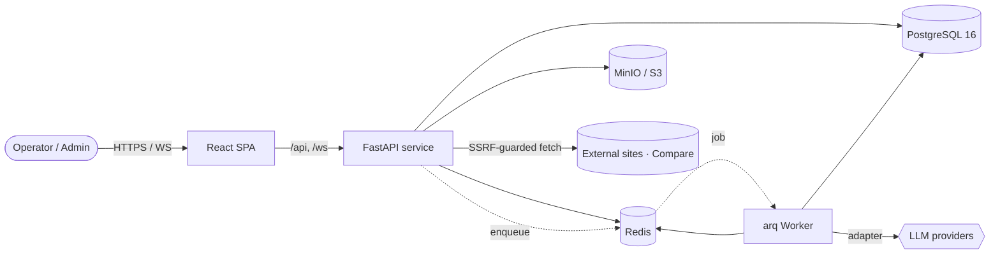
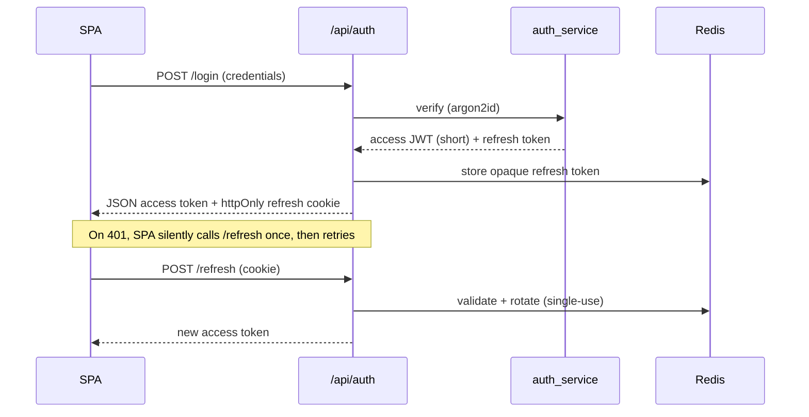

<div align="center">

# PiKaOs

**A Thai-first, multi-agent “agent-ops” workspace** — where teams run, observe, and govern AI agents
like a guild runs quests.


</div>

> **Reader’s note.** This README is written as a compact **Business Analysis (BA)** + **System
> Analysis (SA)** dossier — it states the problem, the stakeholders, the scope, the requirements, and
> the system design behind them. It is intended to read as a professional portfolio artifact, not just
> setup notes.

---

## 1. Executive summary

PiKaOs is a self-hostable platform for **operating fleets of AI agents** with the discipline normally
reserved for production software: identity & access control, queued out-of-process execution, live
observability, quotas, and an auditable trail. It wraps these capabilities in a **Thai-first**,
game-flavored UI (a “guild” metaphor) so non-engineers can participate.

It is built as a **modular monolith** — one deployable today, but cut along bounded contexts so a
single capability can be **extracted and shipped on its own**. The first realized extraction,
[**Website Compare**](https://github.com/hellOoSaksit/PiKaOS-Standalone), proves the seam.

---

## 2. Business analysis (BA)

### 2.1 Problem statement
Organizations adopting LLM agents quickly hit operational, not modeling, walls: *Who is allowed to run
what? How do we stop a runaway job from draining budget? What did the agent actually do, step by step?
How do non-technical staff take part safely?* Off-the-shelf chat UIs answer none of these.

### 2.2 Goals & objectives
| # | Objective | Success measure |
|---|---|---|
| G1 | Govern agent usage by identity + permission | Every write action is permission-checked server-side |
| G2 | Run agents reliably, off the request path | A slow/crashed job never takes the API down |
| G3 | Make every run observable in real time | Per-step worklog streamed to the UI within ~1s |
| G4 | Bound cost & blast radius | Per-user token quota + per-run step/wall-clock ceilings |
| G5 | Lower the barrier for Thai, non-technical users | Fully localized, role-aware, task-oriented UI |

### 2.3 Stakeholders & personas
- **Guild Master / Admin** — manages users, roles, quotas; reads the audit log. (RBAC: `user.manage`, `role.manage`, `audit.view`.)
- **Operator / Member** — runs quests (agent tasks), watches the live worklog, compares sites.
- **Reviewer / Auditor** — inspects what ran, by whom, and the effects.
- **Platform Engineer** — self-hosts the stack, tunes quotas and concurrency.

### 2.4 Scope
**In scope:** authentication & session lifecycle; server-side RBAC; an out-of-process agent execution
engine; live per-step streaming; quotas & limits; a localized SPA; a stateless outbound “Compare” tool;
object/file storage; audit.
**Out of scope (by decision):** a hosted multi-tenant SaaS control plane; a vector database (knowledge
is **markdown-as-truth**); GraphQL; a heavyweight workflow engine (Celery/Temporal) — see §5.

### 2.5 Functional requirements (selected)
- **FR-Auth** — argon2id credentials; short-lived access JWT + rotating refresh token; logout revokes both.
- **FR-RBAC** — every write route declares a required permission; effective permissions are resolved from role + per-user overrides and cached.
- **FR-Engine** — submit an agent run; it executes on a worker, replay-safe, bounded by step/time/quota; cancellable.
- **FR-Observe** — each run step is published live to subscribers of that quest over WebSocket.
- **FR-Compare** — compare a UAT site against Production by sitemap coverage + deep content diff (its own dossier in the [standalone repo](https://github.com/hellOoSaksit/PiKaOS-Standalone)).
- **FR-i18n** — all UI strings are keyed; language + vocabulary “lexicon” are data-driven and hot-swappable.

### 2.6 Non-functional requirements
| Attribute | Requirement |
|---|---|
| **Security** | Server-side authorization; SSRF guard on the only outbound path; secrets only from env; prod-config guard fails fast on dev defaults. |
| **Resilience** | Engine jobs out-of-process; at-least-once queue with replay-safe steps; services auto-restart. |
| **Performance** | Async I/O end-to-end; perms cached in Redis; polite outbound concurrency to avoid WAF throttling. |
| **Observability** | Structured logs stamped with run/quest/agent IDs; live worklog stream. |
| **Portability** | Whole stack in Docker; capabilities extractable to lightweight, single-purpose deployments. |
| **Localization** | Thai-first; 4-level i18n fallback; zero hard-coded UI strings. |

---

## 3. System analysis (SA)

### 3.1 System context



### 3.2 Container / component view

| Layer | Responsibility | Key modules |
|---|---|---|
| **SPA** (Vite + React) | UI, navigation, i18n, RBAC-aware rendering | zero-dependency component kit, `lib/api.js`, `lib/auth.jsx`, `lib/i18n.jsx` |
| **API** (FastAPI) | HTTP/WS edge; parse → service → shape | `routers/*` (thin), `deps.py` (`require_perm`) |
| **Services** | Business logic, orchestration | `services/*_service.py` (no SQL, no FastAPI types) |
| **Repositories** | All SQL (one module per aggregate) | `repositories/*` |
| **Worker** | Out-of-process engine jobs | `worker.py`, `services/agent_runner.py` |
| **Cross-cutting** | Auth, cache, storage, config | `security.py` (argon2 + JWT), `redis_client.py`, `storage.py`, `config.py` |

> **Strict layering (enforced rule):** no business logic in routers, **no SQL outside repositories**,
> every DB/redis/network call is `async`, tokens only via `security.py`. This keeps each layer unit-
> testable and the system easy to reason about.

### 3.3 Key flow — authentication & session



### 3.4 Engine execution model
Agent runs are **queued (arq on Redis) and executed by a separate worker process**, so a slow or
crashed job can never take the API down. Because the queue is at-least-once, each step is **replay-safe**:
tool calls carry an idempotency key, side-effects are classified (`read` / `idempotent_write` /
`side_effect`), and resumption replays by effect class. Runs are bounded by **max steps**, **per-step
timeouts**, and a **wall-clock ceiling**, and consume an **atomic per-user token quota**. Every step is
published to `quest:{id}` on Redis and fanned out to the UI over WebSocket for a **live worklog**.

### 3.5 Security model
- **AuthN:** argon2id hashing; short access JWT (stateless) + opaque rotating refresh token in Redis (httpOnly, path-scoped).
- **AuthZ:** **server-side RBAC** — write routes gate on `require_perm`; effective permissions = role grants ± per-user overrides, cached in Redis with invalidation.
- **SSRF:** the Compare/outbound path validates every URL (incl. redirect hops) against a public-IP allowlist, blocking cloud-metadata / RFC1918 / loopback targets.
- **Config safety:** a startup check refuses to run in `production` with dev-default secrets.

### 3.6 Data & knowledge
Plain **PostgreSQL 16** (pgvector deliberately removed). The schema is a single modular Alembic baseline
organized by bounded context (**core** · **knowledge** · **engine**) with a “FK into core only, or
within self” rule that keeps modules separable. Knowledge is **markdown-as-truth** (an Obsidian-style
store); a vector index, if ever needed, is a rebuildable cache — never the source of truth.

---

## 4. Architecture stance — modular monolith → extractable systems

PiKaOs runs as **one deployable** but is cut so a department can take **only the capability it needs**.
The seam is real, not aspirational: the **Compare** capability has been extracted into a standalone,
login-free, **stateless** app shipped from its own repo. This is the BA payoff of the SA discipline —
lower footprint, faster local deployment, smaller attack surface.

➡️ **[PiKaOS-Standalone — Website Compare](https://github.com/hellOoSaksit/PiKaOS-Standalone)** ·
[download the latest release](https://github.com/hellOoSaksit/PiKaOS-Standalone/releases/latest)

---

## 5. Engineering decisions & trade-offs (log)

| Decision | Choice | Rationale |
|---|---|---|
| Job queue | **arq** (Redis-native) | Reuses Redis; async-native; Celery/Temporal were overkill |
| Knowledge store | **Markdown-as-truth** | Durable, low-maintenance, diff-able; vectors are a rebuildable cache |
| Vector DB | **Removed pgvector** | Unused; plain Postgres is lighter and simpler |
| Authorization | **RBAC in Postgres** | Direct model; Casbin/OPA add a layer for no gain here |
| Frontend deps | **Zero runtime deps** | Hand-built UI kit + design tokens keep the bundle and surface small |
| Packaging | **Modular monolith** | One deployable now, extractable per system later |

---

## 6. Getting started

The whole stack runs in Docker. On Windows, double-click **`start.bat`** — it ensures the Docker engine
is up, runs `docker compose up -d --build` (Postgres · Redis · MinIO · backend · worker · frontend), and
opens **http://localhost:5173**. Default dev login: `somchai` / `pikaos123`.

```bash
docker compose up -d --build      # bring the stack up
docker compose logs -f backend    # watch a service
```

**Repository layout**

| Path | What it is |
|---|---|
| [`Frontend/`](Frontend) | Vite + React SPA (UI, i18n, RBAC-aware) |
| [`Backend/`](Backend) | FastAPI service + arq worker (auth, API, WS, engine) |
| [`design-system/`](design-system) | Static design deliverables (HTML) |
| [`docker-compose.yml`](docker-compose.yml) | Postgres · Redis · MinIO · backend · worker · frontend |

---

## 7. Status & roadmap

- ✅ **Foundation** — auth, server-side RBAC, i18n, Docker stack
- ✅ **Engine (phase B)** — queued runner, replay-safe steps, live worklog, structured logging
- ✅ **Compare** — coverage + deep diff; **extracted to a standalone app**
- 🟡 **Next** — real LLM-provider adapters (HERMES), knowledge ingestion, per-department delivery profiles

---

<div align="center">

**Author** — Saksit Chuenmaiwaiy · built as a full-stack + BA/SA portfolio piece.
Detailed internal documentation is maintained separately.

</div>
