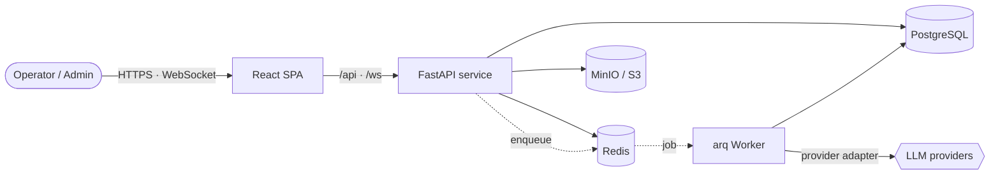

<div align="center">

# PiKaOs

### Operate fleets of AI agents — with the discipline of production software.

A **self-hostable, Thai-first “agent-ops” platform**: run AI agents under real access control, reliable
out-of-process execution, live step-by-step observability, hard cost limits, and a full audit trail —
wrapped in a friendly **guild &amp; quests** experience so non-engineers can take part safely.

[](https://github.com/hellOoSaksit/PiKaOs/releases)
[](https://github.com/hellOoSaksit/PiKaOs/actions/workflows/ci.yml)


</div>

---

## Why PiKaOs?

Adopting LLM agents quickly hits **operational** walls, not modeling ones:

> *Who is allowed to run what? How do we stop a runaway job from draining the budget? What did the agent
> actually do, step by step? How do non-technical staff take part safely?*

Off-the-shelf chat UIs answer none of these. **PiKaOs is the control plane that does** — it treats an agent
run like a governed, observable, bounded production job, and makes the whole thing approachable for a
Thai-speaking, non-technical team.

## What it does

| | Capability | What you get |
| :--: | --- | --- |
| 🛡️ | **Governed runs** | Server-side **RBAC** — every action is permission-checked against role grants ± per-user overrides. Nothing runs that the caller isn’t allowed to run. |
| ⚙️ | **Reliable execution** | Runs are **queued and executed on a separate worker** (arq + Redis). A slow or crashed job can never take the API down. Each run is **replay-safe, cancellable**, and bounded. |
| 📡 | **Live observability** | Every agent step streams to the UI over **WebSocket (~1s)** as a real-time *worklog*; structured logs are stamped with run / quest / agent IDs. |
| 💰 | **Cost &amp; blast-radius control** | **Atomic per-user token quotas** + per-run step and wall-clock ceilings keep spend and damage bounded by design. |
| 🧠 | **Knowledge / RAG** | A **markdown-as-truth** document store agents can retrieve from — durable, diff-able, no vector-DB lock-in. |
| 🌐 | **Website Compare** | A stateless, **SSRF-guarded** tool that diffs a UAT site against production by sitemap coverage + deep content diff — shipped as its own app. |
| 🧾 | **Audit trail** | A reviewable record of **who ran what, when, and with what effect**. |
| 🇹🇭 | **Thai-first UX** | A role-aware, game-flavored **“guild &amp; quests”** interface; fully internationalized with zero hard-coded strings. |
| 📦 | **Self-hostable** | The whole stack runs in **Docker**; individual capabilities can be extracted into lightweight, single-purpose deployments. |

## How it works



The React SPA talks to a **FastAPI** service for HTTP + WebSocket. Agent work is **enqueued to Redis** and
run by a **separate `arq` worker** that calls the LLM providers — so the request path stays fast and the
API stays up even when a job misbehaves. PostgreSQL holds the system of record; MinIO holds files; Redis
backs the queue, the live worklog stream, and the permission cache.

## Architecture — Core + Plugins

PiKaOs ships as **one deployable**, but is cut along clean seams: a small, stable **Core** provides the
infrastructure and the agent runtime, while every feature is a **removable plugin** that talks only through
published contracts. The boundary is **enforced in CI**, not just encouraged:

| Principle | How it’s guaranteed |
| --- | --- |
| **Core never depends on a feature** | `import-linter` fails the build on any Core → plugin or plugin → sibling import. |
| **Every plugin is removable** | A removal-isolation test boots the app with each plugin disabled and asserts the rest still runs. |
| **Plugins declare a contract** | Each ships a schema-validated `manifest.json` (id, version, dependencies, contracts, routes, events). |
| **Features connect through seams** | A dependency-injection container + an event bus — never direct imports. |

This is the engineering payoff of a **modular monolith**: low footprint today, and any capability can be
**extracted and shipped on its own** tomorrow (as [Website Compare](https://github.com/hellOoSaksit/PiKaOs-Plugin) already is).

## Tech stack

**Backend** — FastAPI · async SQLAlchemy + Alembic · an [`arq`](https://arq-docs.helpmanual.io/) worker on
Redis · PostgreSQL 16 · MinIO (S3).
**Frontend** — React 18 + Vite · a zero-runtime-dependency component kit · Thai-first i18n.
**Runtime** — Docker Compose, split into independent stacks (data · backend · AI worker · frontend).

## Repository layout

| Path | Description |
| --- | --- |
| [`PiKaOs-Core/`](PiKaOs-Core) | The platform — `Backend/` (API · worker · plugin framework · agent engine), `Frontend/` (Vite + React), `deploy/` (Docker stacks). |
| [`PiKaOs-App/`](PiKaOs-App) | Composition root — assembles the core with the enabled plugins and runs the full stack. |

| Related repository | Visibility | Purpose |
| --- | --- | --- |
| [PiKaOs-Plugin](https://github.com/hellOoSaksit/PiKaOs-Plugin) | Public | Stand-alone “own-app” plugins (Website Compare, Redirect Map). |
| PiKaOs-Docs | Private | Internal design dossier &amp; engineering knowledge base. |

## Getting started

The full setup, run scripts, and the complete **Business / System Analysis dossier** (with diagrams) live
in the core README:

➡️ **[`PiKaOs-Core/README.md`](PiKaOs-Core/README.md)**

```bash
git clone https://github.com/hellOoSaksit/PiKaOs.git
cd PiKaOs/PiKaOs-Core      # then follow the README to bring up the Docker stacks
```

## Contributing

`main` is protected and trunk-based: branch → pull request → green CI (`frontend` · `architecture` ·
`backend`) → squash-merge. Commits follow [Conventional Commits](https://www.conventionalcommits.org/);
versions are [SemVer](https://semver.org/) and published on the [releases page](https://github.com/hellOoSaksit/PiKaOs/releases).

---

<div align="center">
<sub>Built as a modular monolith — one platform today, cut along clean seams so any capability can be extracted and shipped on its own.</sub>
</div>
