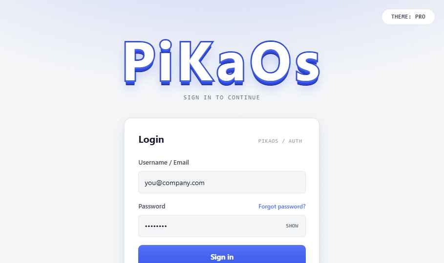
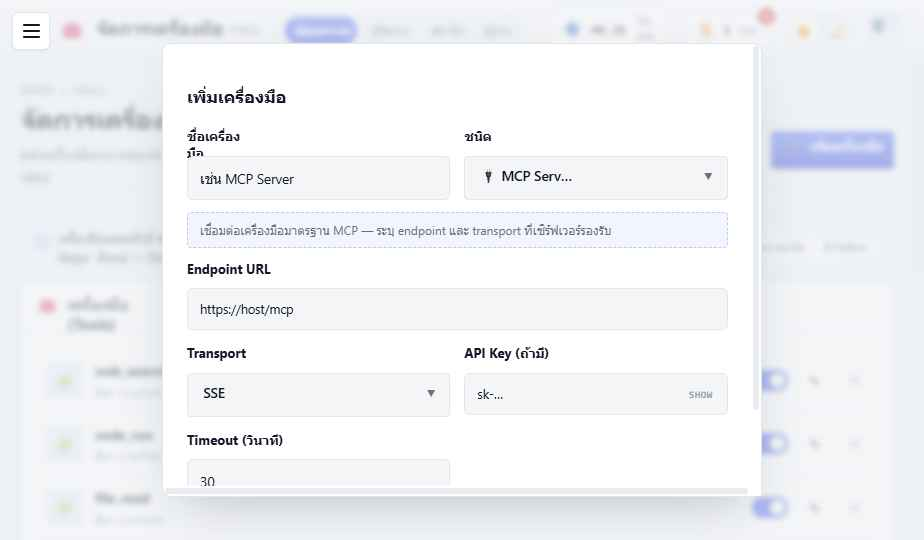

<div align="center">

# ✨ PiKaOs — พื้นที่ทำงานของทีม AI Agent ✨

**บริหารทีม AI ของคุณ… เหมือนเล่นเกม RPG น่ารัก ๆ 🎮**

สร้าง · มอบหมายงาน · ติดตามทีม AI Agent ผ่านห้องทำงาน เควส เครื่องมือ และคลังความรู้
ดีไซน์สะอาด อบอุ่น ภาษาไทยมาก่อน 💜


</div>

---

## 🌈 PiKaOs คืออะไร?

PiKaOs เป็น **"agent-ops workspace"** — ที่ที่คุณสร้างและดูแลทีม AI Agent ได้เหมือนบริหารทีมงานจริง
แต่ห่อหุ้มด้วยกลิ่นเกม RPG เบา ๆ ให้ใช้งานเพลิน เข้าใจง่าย 🧙‍♀️🦉🛠️

> 🐷 *เริ่มจากความวุ่นวายของการจัดการ AI หลายตัว… มาจบที่ที่เดียวที่เป็นระเบียบ น่ารัก และคุมได้*

แทนที่จะตั้งค่า AI กระจัดกระจาย คุมสิทธิ์ไม่ได้ ตามต้นทุนไม่ทัน —
PiKaOs รวมทุกอย่างไว้ในที่เดียว: **Agent · งาน · เครื่องมือ · ความรู้ · สิทธิ์ · โควตา** ✅

---

## 🎀 ฟีเจอร์น่ารักที่ได้

- 👔 **สร้าง Agent ของคุณเอง** — ตั้งบทบาท ทักษะ เครื่องมือ โมเดล และกฎ (สถานะอัปเดตเองโดย AI!)
- 📜 **กระดานเควส** — มอบหมายงานให้ Agent แล้วดูคิว → กำลังทำ → เสร็จ พร้อมบันทึกงาน
- 🌍 **ห้องทำงาน (World)** — มุมมอง top-down น่ารัก เห็นทีมเดินไปเดินมา
- 🧰 **คลังเครื่องมือ** — ต่อ MCP · LINE OA · Telegram · HTTP · Webhook ฯลฯ ได้ในที่เดียว
- 📚 **คลังความรู้ (Codex) + ค้นหาแบบมีอ้างอิง** — ลดงานซ้ำ ลด AI มั่ว
- 🔑 **สิทธิ์ละเอียด (RBAC)** + โควตา token รายคน + บันทึกการตรวจสอบ
- 🌗 **2 ธีม** สว่าง/มืด · 🗣️ **หลายภาษา/สำเนียง** (ทางการ · แฟนตาซี · จอมยุทธ์!) สลับได้ทันที
- 🧠 **หลายโมเดล** — GPT · Claude · โมเดลโลคอล เลือกได้ต่อ Agent

---

## 🖼️ หน้าตาแอป

<div align="center">



<br/><br/>


&nbsp;


</div>

---

## 🚀 เริ่มเล่นยังไง

ง่ายมาก แค่ **ดับเบิลคลิก** 👉 [`start.bat`](start.bat)

มันจะดูแลให้ทั้งหมดเลย 💫
1. 🐳 เช็ก/เปิด Docker ให้ (ถ้าไม่ขึ้นก็เรียก [`fix-docker.bat`](fix-docker.bat) ซ่อมให้)
2. 🧩 ยกระบบหลังบ้านขึ้น (Postgres + pgvector · Redis · MinIO · API)
3. 🪟 เปิด Windows Terminal เป็นแท็บ ๆ (Frontend · Backend · Docker · Shell)
4. 🌐 เว็บรันที่ **http://localhost:5173**

แล้ว **ล็อกอินด้วย:**

| ชื่อผู้ใช้ | รหัสผ่าน | บทบาท |
|---|---|---|
| `somchai` | `pikaos123` | แอดมิน (เห็นทุกอย่าง) ⭐ |

> 💡 มีบัญชีเดโม่อื่นด้วย (`nicha` ผู้จัดการ · `kitt` `ploy` สมาชิก · `anan` ผู้อ่าน) — รหัสเดียวกันหมด `pikaos123`

---

## 🧱 สร้างด้วยอะไร

| ส่วน | เทคโนโลยี |
|---|---|
| 🎨 หน้าบ้าน | **Vite + React** · ดีไซน์ซิสเทมของ PiKaOs เอง · i18n แบบ key-based |
| ⚙️ หลังบ้าน | **FastAPI** (Python) · SQLAlchemy async · JWT + Redis (ล็อกอินจริง) |
| 🗄️ ข้อมูล | **PostgreSQL + pgvector** · **Redis** · **MinIO** (เก็บไฟล์ md/รูป/log/pdf) |
| 🐳 รวมร่าง | **docker-compose** ยกหลังบ้านขึ้นทั้งชุดในคำสั่งเดียว |

---

## 🗂️ โครงสร้างโปรเจกต์

```
PiKaOs/
├── 🎨 Frontend/        เว็บแอป Vite + React
├── ⚙️ Backend/         FastAPI (auth · API · WebSocket)
├── 🐳 docker-compose.yml   Postgres+pgvector · Redis · MinIO · backend
├── 🎀 design-system/   ดีไซน์ซิสเทม + พรีวิว + สไลด์ System Design
├── 📚 docs/            เอกสารโปรเจกต์ (ดู docs/README.md)
└── 🚀 start.bat        ปุ่มเริ่มเล่น (ดับเบิลคลิก!)
```

---

## 📍 สถานะตอนนี้

- ✅ **ระบบ Login เสร็จครบ** — auth จริงบน Postgres, โครงสร้างหลังบ้านพร้อม, เทสต์ผ่าน
- 🟡 **กำลังจะทำต่อ** — เครื่องยนต์รัน Agent (HERMES orchestration), เชื่อมโมเดล, เครื่องมือ + RAG

อยากเห็นภาพใหญ่ทั้งหมด? 👉 อ่าน [**System Design**](docs/architecture/system-design.md) (มีไดอะแกรม + ER เต็ม)
หรือเปิดสไลด์ [`design-system/System Design Presentation.html`](design-system/System%20Design%20Presentation.html) 🖥️✨

---

<div align="center">

สร้างด้วย 💜 โดย **saksit chuenmaiwaiy**

*PiKaOs — ทำงานกับ AI ให้เป็นเรื่องสนุก* 🐷✨

</div>
