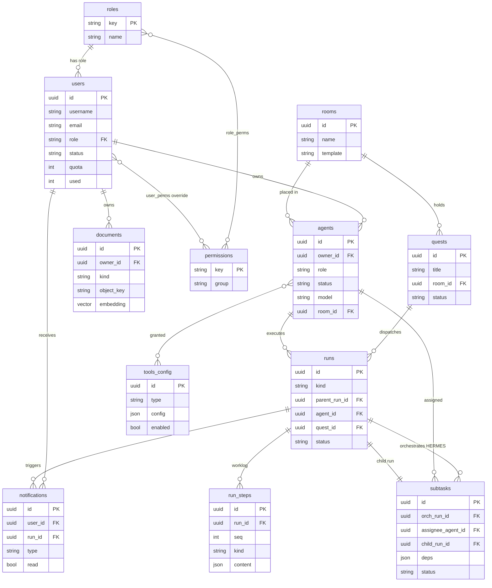

# PiKaOs — System Design

> Living architecture document for **PiKaOs**, the Thai-first multi-agent "agent-ops"
> workspace. This is the blueprint the code is built toward — read it with
> [`README.md`](../../README.md) (project overview).
> Status tags: ✅ built · 🟡 designed (this doc) · ⚪ future.
> Companions: [`design-review.md`](design-review.md) (critical review) ·
> [`risk-mitigation.md`](risk-mitigation.md) (accepted mitigations — read before building the engine).

---

## 1. Purpose & scope

PiKaOs runs a team of AI **agents** through quests, rooms, tools and a knowledge codex.
The product's heart is an **agent-ops engine** that actually executes agents (LLM + tools)
and a **HERMES** orchestrator that decomposes a quest across multiple agents. Everything
in the UI today is real React, but the execution side is still mock/localStorage — this
doc designs the real engine.

---

## 2. Current architecture ✅

```
Browser ──/api──▶ Vite proxy ──▶ FastAPI ──▶ Postgres + pgvector
        ──/ws───▶                  │  ├──▶ Redis  (refresh tokens, denylist, pub/sub bus)
                                    │  └──▶ MinIO  (objects: md / img / log / pdf)
```

- **Auth** ✅ — JWT access token + opaque refresh token in Redis (httpOnly cookie),
  argon2id hashing. See `Backend/app/services/auth_service.py`.
- **Layering** ✅ — `routers/` (HTTP) → `services/` (logic) → `repositories/` (SQL).
- **Infra** ✅ — `docker-compose.yml`: db (pgvector/pg16), redis, minio, backend.
  Frontend runs via `npm`/`start.bat` (not in compose).
- **Real-time** ✅ scaffold — FastAPI `/ws` authenticated by access token, relayed over
  a Redis pub/sub channel (`Backend/app/routers/ws.py`).

---

## 3. Target architecture 🟡

Add an **arq worker** process (same image, different entrypoint) and a small number of
new tables. No new infra — the worker uses the Redis and Postgres we already run.

```
                         ┌──────────── FastAPI (web) ────────────┐
Browser ──/api──────────▶│ routers → services → repositories     │
        ──/ws (per quest)│ enqueue arq jobs · serve reads        │
                         └───────┬───────────────────────┬───────┘
                                 │ Redis queue            │ Redis pub/sub
                                 ▼                        ▲ (per-step events)
                         ┌──── arq worker(s) ────┐        │
                         │ hermes_plan/advance/   │────────┘
                         │ finalize · agent_run   │  ──▶ Postgres (runs, run_steps, subtasks)
                         │ (LLM loop + tools)     │  ──▶ MinIO (artifacts)
                         └────────────────────────┘  ──▶ LLM providers via adapter:
                                                          OpenAI · Anthropic · Local
```

**Decision log**
| Decision | Choice | Why |
|---|---|---|
| Job/queue | **arq** (Redis) + async worker | Redis already present; async-native (FastAPI/asyncpg); light vs Celery; Temporal overkill now |
| Durability | **step-persistence** in Postgres `run_steps` | replay/resume on crash without Temporal |
| Orchestration | **HERMES = reactive state-machine** (event-driven, DAG in Postgres) | doesn't pin a worker while waiting; survives restarts; scales |
| Streaming | **per-step** events (one per LLM turn / tool call) | simple WS, low traffic; token-delta streaming is a later upgrade |
| Scope | **HERMES (multi-agent) from the start** | the product is multi-agent; single-agent is just a 1-node DAG |
| LLM | **Multi-provider adapter** — OpenAI (GPT) · Anthropic (Claude) · Local (OpenAI-compatible: Ollama/vLLM) | model chosen **per-agent**; one unified `llm` interface; tool-use normalized across providers; verify each SDK when implementing |
| Delivery semantics | **at-least-once** (arq) + replay-safe steps | jobs may re-run; correctness comes from two-phase tool steps + effect classes ([risk-mitigation §1](risk-mitigation.md)) — never assume exactly-once |

---

## 4. Agent execution engine 🟡

An **agent run** = one agent executing one task via a loop of LLM calls + tool calls.

**Lifecycle**
```
queued → running → (waiting_input ↺ | calling_tool ↺) → done | failed | cancelled
```

**The loop** (`services/agent_runner.run(run_id)`, executed by the arq worker):
1. Load run + agent config (role, skills, model, granted tools) + RAG context (pgvector).
2. Call the agent's **LLM via the provider adapter** (system + messages + tool schemas),
   **streaming**, per-step. Provider + model are chosen per-agent (OpenAI · Anthropic · Local).
3. If `stop_reason == "tool_use"` → **two-phase**: persist the `tool` step first
   (`status=pending`, deterministic `idempotency_key = "{run_id}:{seq}"`), then dispatch to the
   Tools subsystem, then update the step → `done` with the `tool_result`.
4. **Persist each step** to `run_steps` (Postgres) **and** publish one event to
   Redis `quest:<id>` (→ WS → browser).
5. Loop, bounded by `max_steps`, **per-step timeouts** (`run_llm_step_timeout_s` /
   `run_tool_step_timeout_s`) + `run_max_wallclock_s`, and the user's token **quota** — reserved
   atomically (`UPDATE users SET used = used + :n WHERE used + :n <= quota RETURNING`; no
   read-then-add race across concurrent runs).
6. Terminal → set `run.status`, set `agent.status` back to idle, emit final event.

**LLM provider adapter** — PiKaOs is **multi-model**. The runner never calls a vendor SDK
directly; a thin `llm` interface — `complete(model, messages, tools, stream)` — dispatches to
**OpenAI (GPT)**, **Anthropic (Claude)**, or a **local** OpenAI-compatible endpoint
(Ollama / vLLM), and normalizes tool-use (Anthropic `tool_use` ↔ OpenAI function-calling) so the
agent loop stays provider-agnostic. Each agent's `model` field selects provider + model.

**Invariants**
- **Status is set by the AI/runner only** — never user-settable (product rule).
- **Resume (replay-safe, not "idempotent")** — on worker restart, a run stuck in `running`
  reconstructs its conversation from `run_steps` and continues. LLM steps may re-run freely;
  a `tool` step found `pending` is decided by its **effect class**: `read` / `idempotent_write`
  → re-run with the same `idempotency_key`; `side_effect` → **never auto-retried** — the run
  drops to `waiting_input` for human confirmation ([risk-mitigation §1](risk-mitigation.md)).
- **Cancel** — Redis key `run:<id>:cancel`, checked between steps **and** enforced mid-step via
  task cancellation + the per-step timeouts above (a hung LLM/tool call cannot run unbounded).
- **Human-in-the-loop** — when the agent asks a question, the run enters `waiting_input`
  and emits a notification; the user's answer resumes the run.

---

## 5. HERMES orchestration 🟡

HERMES decomposes a quest into a **DAG of subtasks** and assigns them to agents. It is a
**reactive state-machine** — three small arq jobs advance persisted state; nothing holds a
worker while children run.

```
POST /api/quests/{id}/dispatch
   → create orchestration run (kind=orchestration) + enqueue hermes_plan → 202 {run_id}

hermes_plan(orch_id):                      # once, at start
   load quest + idle agents (roles/skills/tools) + RAG context
   LLM → decompose into subtasks[] {title, assignee_agent, deps[], brief}
   validate the DAG (deps in same orch, acyclic; capped by hermes_max_children / hermes_max_depth)
   write subtasks (DAG) to Postgres + create a brief doc per subtask
   spawn subtasks whose deps are satisfied → enqueue agent_run(child_id) each
   exit (does NOT wait)

agent_run(child_id):                       # the §4 loop; on finish:
   → enqueue hermes_advance(orch_id)

hermes_advance(orch_id):                   # event-driven tick, per child completion
   mark the finished child's subtask done
   spawn newly-ready subtasks (deps now satisfied)
   if every subtask terminal →
      UPDATE runs SET status='finalizing' WHERE id=:orch AND status='running' RETURNING
      (atomic — only the winner enqueues hermes_finalize; concurrent ticks no-op)

hermes_finalize(orch_id):
   LLM synthesises the children's outputs → orchestration run = done
```

**Product mapping**
- **brief / worklog** → brief = a subtask's brief Document (RichBody); worklog = that run's
  `run_steps` rendered as a timeline.
- **"งานเข้าคิวห้อง"** → a subtask is assigned to a room; the room shows its subtask queue.
- **Notifications** → a child entering `waiting_input` emits a notification card; answering
  resumes it (human-in-the-loop).

**Failure policy** — a failed child marks its subtask `failed` in `hermes_advance`; policy
starts simple: retry up to N times, else finalize with a partial result and surface it.

---

## 6. Real-time (WebSocket) 🟡

- Browser opens `/ws` (**no token in the URL** — query strings get logged by proxies); the
  **first message** must be `{"type":"auth","token":<access JWT>}` within 5s, else close 4401.
- `{"type":"subscribe","quest_id"}` → backend **authorizes** (user may view that quest — owner /
  room member / `quest.view.any`) before subscribing the socket to Redis `quest:<id>`. One socket
  may subscribe to several quests; `unsubscribe` detaches.
- **Replay**: on subscribe the server sends a snapshot of recent `run_steps`; every event carries
  `(run_id, seq)` so the client detects gaps and requests `backfill` — mid-run page opens and
  reconnects lose nothing.
- **Payload cap**: events ≤ ~32KB; large tool outputs go to MinIO and the event carries the
  `object_key` instead of the body.
- Every run (HERMES + children) publishes **one event per step** — the browser renders a live
  worklog timeline and agent-status changes. (Replaces the current single-channel scaffold, which
  broadcast every message to every authenticated client — [risk-mitigation §3](risk-mitigation.md).)

---

## 7. Data model 🟡 (additions beyond `users` ✅)

| table | key columns |
|---|---|
| `agents` | id, owner_id, name, role, status (AI-set), model, skills[], granted_tools[], sprite, room_id |
| `rooms` | id, name, template, created_by |
| `quests` | id, title, brief, room_id, status, created_by, soft-deleted |
| `runs` | id, **kind** (orchestration\|agent), **parent_run_id**, agent_id, quest_id, room_id, status, input, tokens_used, error, started_at, ended_at |
| `subtasks` (DAG) | id, orch_run_id, title, brief_doc_id, assignee_agent_id, **deps[]**, status, child_run_id, result_summary |
| `run_steps` | id, run_id, seq, kind (llm\|tool\|message\|status), **status (pending\|done\|failed)**, **idempotency_key**, role, content (jsonb), tokens, created_at — **worklog + replay**; **UNIQUE(run_id, seq)** |
| `documents` ✅ | id, owner_id, kind, name, object_key, content_type, size, **embedding vector(1536)**, created_at |
| `tools_config` | id, name, type, config (jsonb), enabled |
| `notifications` | id, user_id, type, body, run_id, read, created_at |
| RBAC | `roles`, `permissions`, `role_perms`, `user_perms` (move from client → server, §10) |

FK / cascade / index policy for all of the above is defined in
[risk-mitigation §4.4](risk-mitigation.md) and lands in the **first** engine migration
(e.g. `run_steps.run_id` CASCADE, `runs.agent_id` SET NULL, self-FK on `runs.parent_run_id`).

### 7.1 Department scoping 🟡 (multi-tenancy = องค์กรเดียว หลายแผนก)

**ตัดสินใจ 2026-06-12**: PiKaOs = **องค์กรเดียว หลายแผนก** — ไม่ใช่ multi-org SaaS. `department`
เป็นมิติ **scoping/visibility** ภายใน org เดียว ไม่ใช่ hard isolation ระหว่างลูกค้า. ต้องลงตั้งแต่
**migration แรกของ engine** — เพิ่มทีหลัง = backfill ทุกตาราง (ราคาเดียวกับ `workspace_id` retrofit เดิม).

- ตาราง `departments` (id, name_th, name_en, created_at) — org เดียว ไม่ต้องมีตาราง org แม่.
- ตาราง `user_departments` (user_id FK, department_id FK, is_primary bool) — **many-to-many**:
  **1 user อยู่ได้หลายแผนก** (PM/PO/บทบาทข้ามสายงาน). `is_primary` = แผนกตั้งต้น (default ตอนสร้าง
  ทรัพยากร + ค่าเริ่มของ UI). **ไม่มี `users.department_id` เดี่ยว** — สังกัดอ่านจาก join นี้.
- คอลัมน์ `department_id` บน **scopable tables**: `agents`, `rooms`, `quests`, `documents` +
  **denormalize ลง `runs`** เพื่อ filter เร็ว. `nullable` = ทรัพยากรกลางที่แชร์ทั้ง org; `quests`/`runs`
  สืบ department จาก room/agent ตอนสร้าง. ทรัพยากรใหม่ผูกแผนกที่ผู้สร้างเลือกจากชุดที่ตนสังกัด (default = `is_primary`).
- RBAC ตั้งฉากกับ department: roles/permissions ยัง **org-wide** ([§10](#10-rbac-server-side-)); enforcement =
  `require_perm(...)` เช็คสิทธิ์ **+ scope check** ว่า `resource.department_id ∈ แผนกของ user`
  เว้นแต่มี cross-dept perm (`<res>.view.any` / `department.view.any`).

### ER diagram (all entities — ✅ built: `users`, `documents`; the rest 🟡 planned)



---

## 8. Knowledge / RAG ⚪

`documents` ✅ table + MinIO ✅ already exist. Pipeline: upload to MinIO → extract text
(md/pdf/img-OCR/log) → chunk → embed → store vectors in pgvector → retrieve top-k as agent
context at run start. Embeddings provider + chunking strategy TBD.

> **Storage decision locked (2026-06-16)** → [`knowledge-rag.md`](knowledge-rag.md): **markdown =
> source of truth** (durable, low-maintenance), **pgvector = derived rebuildable cache** opened only
> when retrieval pain is real; rule = rebuild one-way `markdown → vector`, never data-only-in-vector.

## 9. Tools subsystem + security ⚪

Central registry (`tools_config`, type + per-type config) drives what an agent may call:
**MCP server · LINE OA · Telegram · CMD/PowerShell · HTTP API · Webhook**. Each type has a
handler invoked from the agent loop (§4 step 3). **Security is the hard part** — CMD/PowerShell
must be sandboxed (container/jailed, allow-list, timeouts, no host mounts), secrets pulled from
a vault not the prompt, and tools granted per-agent via RBAC. Designed in a later session.

## 10. RBAC server-side ⚪

Today roles/permissions live client-side (seed in `data-users.jsx`). Move `roles`,
`permissions`, `role_perms`, `user_perms` to Postgres; enforce in a `require_perm("...")`
dependency; `/api/auth/me` returns the effective permission set (cached in Redis, invalidated
on role/override change). **Scheduled as build step 0** — it must land before the first
write endpoint, not after the engine ([risk-mitigation §2](risk-mitigation.md)).

---

## 11. Build order 🟡

Security first (0–1), then engine correctness baked into the first schema (2), then the
expensive parts (3–4) once a stub test harness exists. Full rationale + per-step risk mapping:
[risk-mitigation §7](risk-mitigation.md).

0. **RBAC server-side** — `roles`/`permissions`/`role_perms`/`user_perms` tables, `require_perm`,
   `/me` returns effective perms. Lands **before** the first write endpoint.
   (+ quick wins: `documents.owner_id` FK · prod boot asserts on secrets.)
1. **WS refactor** — first-message auth (token out of the URL), per-quest channels + authz,
   snapshot/backfill replay. Lands **before** the engine publishes its first event.
2. **Engine core** — engine tables (FK/UNIQUE/index per risk-mitigation §4.4); arq worker in
   compose; `agent_runner.run` loop with a **stub LLM + a stub side-effect tool** (tests
   two-phase resume from day one); atomic quota; per-step timeouts.
3. **LLM integration** — provider **adapter** (OpenAI · Anthropic · Local/OpenAI-compatible),
   normalized tool-use + streaming; per-provider rate-limit (Redis token-bucket) + backoff;
   prompt caching where available.
4. **HERMES** — `hermes_plan/advance/finalize`; DAG capped (children/depth); atomic finalize;
   `Idempotency-Key` on dispatch; brief docs.
5. **Tools subsystem** — handlers per **effect class** + sandboxing + per-agent grants.
6. **RAG** — decide embedding model/dim **before** first ingest; ingestion → pgvector retrieval;
   human-in-the-loop notifications.

---

## 12. Open questions

- Embeddings provider + dimension — direction set in [risk-mitigation §5.3](risk-mitigation.md)
  (one platform-wide dim + `embedding_model` column); final model TBD **before** first ingest.
- **Multi-tenancy** ✅ **ตัดสินใจแล้ว (2026-06-12): องค์กรเดียว หลายแผนก** — ไม่ใช่ multi-org SaaS.
  แผนก (`department`) เป็นมิติ scoping/visibility ภายใน org เดียว (user pool + RBAC นิยามร่วมทั้ง org),
  ไม่ใช่ hard tenant isolation. Schema lands ใน migration แรกของ engine — ดู [§7.1](#71-department-scoping-).
- Sandboxing approach for CMD/PowerShell tools (per-run ephemeral container?) — needs the
  "runs on user's Windows host vs server-side container" requirement first.
- Model API keys: **platform-level env keys** for now (`config.settings` only, never in
  prompts/DB) — per-agent keys deferred to multi-tenant future ([risk-mitigation §5.4](risk-mitigation.md)).
- Retry/escalation policy when a subtask repeatedly fails (start: retry N=2 → partial finalize;
  confirm N with product owner).
