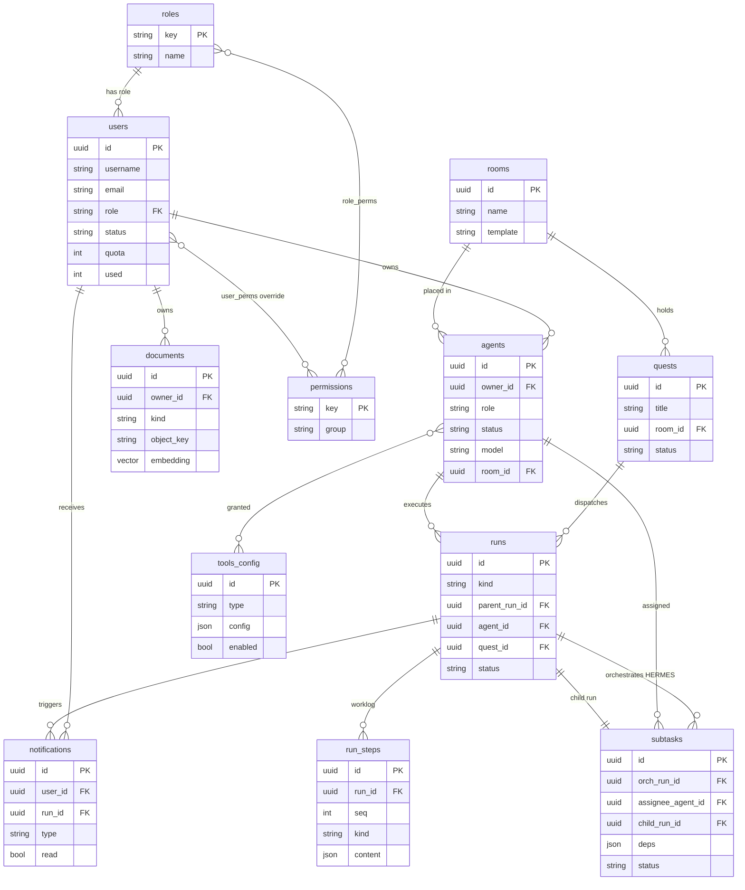

# PiKaOs — System Design

> Living architecture document for **PiKaOs**, the Thai-first multi-agent "agent-ops"
> workspace. This is the blueprint the code is built toward — read it with
> [`README.md`](../README.md) (overview) and [`CLAUDE.md`](../CLAUDE.md) (dev rules).
> Status tags: ✅ built · 🟡 designed (this doc) · ⚪ future.

---

## 1. Purpose & scope

PiKaOs runs a team of AI **agents** through quests, rooms, tools and a knowledge codex.
The product's heart is an **agent-ops engine** that actually executes agents (LLM + tools)
and a **HERMES** orchestrator that decomposes a quest across multiple agents. Everything
in the UI today is real React, but the execution side is still mock/localStorage — this
doc designs the real engine.

---

## 2. Current architecture ✅

```
Browser ──/api──▶ Vite proxy ──▶ FastAPI ──▶ Postgres + pgvector
        ──/ws───▶                  │  ├──▶ Redis  (refresh tokens, denylist, pub/sub bus)
                                    │  └──▶ MinIO  (objects: md / img / log / pdf)
```

- **Auth** ✅ — JWT access token + opaque refresh token in Redis (httpOnly cookie),
  argon2id hashing. See `Backend/app/services/auth_service.py`.
- **Layering** ✅ — `routers/` (HTTP) → `services/` (logic) → `repositories/` (SQL).
- **Infra** ✅ — `docker-compose.yml`: db (pgvector/pg16), redis, minio, backend.
  Frontend runs via `npm`/`start.bat` (not in compose).
- **Real-time** ✅ scaffold — FastAPI `/ws` authenticated by access token, relayed over
  a Redis pub/sub channel (`Backend/app/routers/ws.py`).

---

## 3. Target architecture 🟡

Add an **arq worker** process (same image, different entrypoint) and a small number of
new tables. No new infra — the worker uses the Redis and Postgres we already run.

```
                         ┌──────────── FastAPI (web) ────────────┐
Browser ──/api──────────▶│ routers → services → repositories     │
        ──/ws (per quest)│ enqueue arq jobs · serve reads        │
                         └───────┬───────────────────────┬───────┘
                                 │ Redis queue            │ Redis pub/sub
                                 ▼                        ▲ (per-step events)
                         ┌──── arq worker(s) ────┐        │
                         │ hermes_plan/advance/   │────────┘
                         │ finalize · agent_run   │  ──▶ Postgres (runs, run_steps, subtasks)
                         │ (LLM loop + tools)     │  ──▶ MinIO (artifacts)
                         └────────────────────────┘  ──▶ LLM providers via adapter:
                                                          OpenAI · Anthropic · Local
```

**Decision log**
| Decision | Choice | Why |
|---|---|---|
| Job/queue | **arq** (Redis) + async worker | Redis already present; async-native (FastAPI/asyncpg); light vs Celery; Temporal overkill now |
| Durability | **step-persistence** in Postgres `run_steps` | replay/resume on crash without Temporal |
| Orchestration | **HERMES = reactive state-machine** (event-driven, DAG in Postgres) | doesn't pin a worker while waiting; survives restarts; scales |
| Streaming | **per-step** events (one per LLM turn / tool call) | simple WS, low traffic; token-delta streaming is a later upgrade |
| Scope | **HERMES (multi-agent) from the start** | the product is multi-agent; single-agent is just a 1-node DAG |
| LLM | **Multi-provider adapter** — OpenAI (GPT) · Anthropic (Claude) · Local (OpenAI-compatible: Ollama/vLLM) | model chosen **per-agent**; one unified `llm` interface; tool-use normalized across providers; verify each SDK when implementing |

---

## 4. Agent execution engine 🟡

An **agent run** = one agent executing one task via a loop of LLM calls + tool calls.

**Lifecycle**
```
queued → running → (waiting_input ↺ | calling_tool ↺) → done | failed | cancelled
```

**The loop** (`services/agent_runner.run(run_id)`, executed by the arq worker):
1. Load run + agent config (role, skills, model, granted tools) + RAG context (pgvector).
2. Call the agent's **LLM via the provider adapter** (system + messages + tool schemas),
   **streaming**, per-step. Provider + model are chosen per-agent (OpenAI · Anthropic · Local).
3. If `stop_reason == "tool_use"` → dispatch to the Tools subsystem → append `tool_result`.
4. **Persist each step** to `run_steps` (Postgres) **and** publish one event to
   Redis `quest:<id>` (→ WS → browser).
5. Loop, bounded by `max_steps` + the user's token **quota** (`users.used/quota`).
6. Terminal → set `run.status`, set `agent.status` back to idle, emit final event.

**LLM provider adapter** — PiKaOs is **multi-model**. The runner never calls a vendor SDK
directly; a thin `llm` interface — `complete(model, messages, tools, stream)` — dispatches to
**OpenAI (GPT)**, **Anthropic (Claude)**, or a **local** OpenAI-compatible endpoint
(Ollama / vLLM), and normalizes tool-use (Anthropic `tool_use` ↔ OpenAI function-calling) so the
agent loop stays provider-agnostic. Each agent's `model` field selects provider + model.

**Invariants**
- **Status is set by the AI/runner only** — never user-settable (product rule).
- **Resume** — on worker restart, a run stuck in `running` reconstructs its conversation
  from `run_steps` and continues at the next step (steps are idempotent).
- **Cancel** — Redis key `run:<id>:cancel`, checked between steps.
- **Human-in-the-loop** — when the agent asks a question, the run enters `waiting_input`
  and emits a notification; the user's answer resumes the run.

---

## 5. HERMES orchestration 🟡

HERMES decomposes a quest into a **DAG of subtasks** and assigns them to agents. It is a
**reactive state-machine** — three small arq jobs advance persisted state; nothing holds a
worker while children run.

```
POST /api/quests/{id}/dispatch
   → create orchestration run (kind=orchestration) + enqueue hermes_plan → 202 {run_id}

hermes_plan(orch_id):                      # once, at start
   load quest + idle agents (roles/skills/tools) + RAG context
   LLM → decompose into subtasks[] {title, assignee_agent, deps[], brief}
   write subtasks (DAG) to Postgres + create a brief doc per subtask
   spawn subtasks whose deps are satisfied → enqueue agent_run(child_id) each
   exit (does NOT wait)

agent_run(child_id):                       # the §4 loop; on finish:
   → enqueue hermes_advance(orch_id)

hermes_advance(orch_id):                   # event-driven tick, per child completion
   mark the finished child's subtask done
   spawn newly-ready subtasks (deps now satisfied)
   if every subtask terminal → enqueue hermes_finalize

hermes_finalize(orch_id):
   LLM synthesises the children's outputs → orchestration run = done
```

**Product mapping**
- **brief / worklog** → brief = a subtask's brief Document (RichBody); worklog = that run's
  `run_steps` rendered as a timeline.
- **"งานเข้าคิวห้อง"** → a subtask is assigned to a room; the room shows its subtask queue.
- **Notifications** → a child entering `waiting_input` emits a notification card; answering
  resumes it (human-in-the-loop).

**Failure policy** — a failed child marks its subtask `failed` in `hermes_advance`; policy
starts simple: retry up to N times, else finalize with a partial result and surface it.

---

## 6. Real-time (WebSocket) 🟡

- Browser opens `/ws?token=...`, **subscribes to a quest/run id**.
- Backend relays Redis pub/sub messages for that quest's channel (`quest:<id>`) to the socket.
- Every run (HERMES + children) publishes **one event per step** — the browser renders a
  live worklog timeline and agent-status changes. (Refines the current single-channel scaffold
  into per-quest channels.)

---

## 7. Data model 🟡 (additions beyond `users` ✅)

| table | key columns |
|---|---|
| `agents` | id, owner_id, name, role, status (AI-set), model, skills[], granted_tools[], sprite, room_id |
| `rooms` | id, name, template, created_by |
| `quests` | id, title, brief, room_id, status, created_by, soft-deleted |
| `runs` | id, **kind** (orchestration\|agent), **parent_run_id**, agent_id, quest_id, room_id, status, input, tokens_used, error, started_at, ended_at |
| `subtasks` (DAG) | id, orch_run_id, title, brief_doc_id, assignee_agent_id, **deps[]**, status, child_run_id, result_summary |
| `run_steps` | id, run_id, seq, kind (llm\|tool\|message\|status), role, content (jsonb), tokens, created_at — **worklog + replay** |
| `documents` ✅ | id, owner_id, kind, name, object_key, content_type, size, **embedding vector(1536)**, created_at |
| `tools_config` | id, name, type, config (jsonb), enabled |
| `notifications` | id, user_id, type, body, run_id, read, created_at |
| RBAC | `roles`, `role_perms`, `user_perms` (move from client → server, §9) |

### ER diagram (all entities — ✅ built: `users`, `documents`; the rest 🟡 planned)



---

## 8. Knowledge / RAG ⚪

`documents` ✅ table + MinIO ✅ already exist. Pipeline: upload to MinIO → extract text
(md/pdf/img-OCR/log) → chunk → embed → store vectors in pgvector → retrieve top-k as agent
context at run start. Embeddings provider + chunking strategy TBD.

## 9. Tools subsystem + security ⚪

Central registry (`tools_config`, type + per-type config) drives what an agent may call:
**MCP server · LINE OA · Telegram · CMD/PowerShell · HTTP API · Webhook**. Each type has a
handler invoked from the agent loop (§4 step 3). **Security is the hard part** — CMD/PowerShell
must be sandboxed (container/jailed, allow-list, timeouts, no host mounts), secrets pulled from
a vault not the prompt, and tools granted per-agent via RBAC. Designed in a later session.

## 10. RBAC server-side ⚪

Today roles/permissions live client-side (seed in `data-users.jsx`). Move `roles`,
`role_perms`, `user_perms` to Postgres; enforce in a `require_perm` dependency; `/api/auth/me`
returns the effective permission set.

---

## 11. Build order 🟡

1. **Engine core** — arq worker service in compose; `runs`/`run_steps`/`subtasks` tables
   (Alembic); `agent_runner.run` loop with a **stub LLM** (no real provider yet) + per-step WS.
2. **LLM integration** — a provider **adapter** (OpenAI · Anthropic · Local/OpenAI-compatible)
   with a normalized tool-use loop + streaming; per-provider prompt caching where available.
3. **HERMES** — `hermes_plan/advance/finalize`; DAG; brief docs; per-quest WS channels.
4. **Tools subsystem** — handlers + sandboxing + per-agent grants.
5. **RAG** — ingestion → pgvector retrieval in the loop.
6. **RBAC server-side**; human-in-the-loop notifications.

---

## 12. Open questions

- Embeddings provider + dimension (the `documents.embedding` is `vector(1536)` as a placeholder).
- Sandboxing approach for CMD/PowerShell tools (per-run ephemeral container?).
- Where model API keys live (per-agent/per-provider secrets vs platform-level keys per provider:
  OpenAI / Anthropic / local endpoint URLs).
- Retry/escalation policy when a subtask repeatedly fails.
